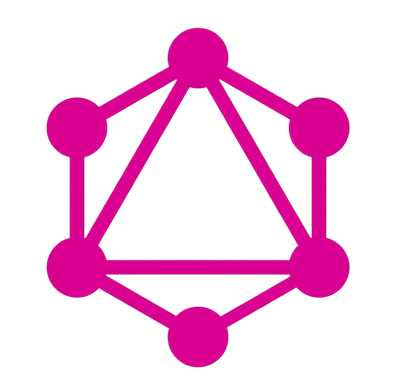

  
  <h3 align="center">
    Hey there, I'm <a href="#">Joaquín</a>! 
    
  </h3>

---

## 📌 About Me  

  

👨‍💻 **Software Engineer | Backend Developer**  
🔧 Specialized in **Laravel, Node.js, TypeScript & PostgreSQL**  
🚀 Passionate about building **scalable** and **secure** applications  
📚 Continuous learner, technology enthusiast, and problem solver  

---

# ⚡ Tech Stack
## Backend

  <table>
    <tr>
      <td align="center"> TypeScript</td>
      <td align="center"> NodeJS <a href="https://platzi.com/p/orihuelajoaquin99/learning-path/7048-web-node/diploma/detalle/" target="_blank">(ver certificado)</a></td>
      <td align="center"> Laravel</td>
      <td align="center"> ExpressJS <a href="https://www.udemy.com/certificate/UC-524b78d6-0dd7-43ed-9cc0-538d04430801/" target="_blank">(ver certificado)</a></td>
      <td> NestJS</td>
      <td> GraphQL</td>
    </tr>
  </table>

## Frontend

  <table>
    <tr>
      <td align="center"> ReactJS</td>
      <td align="center"> NextJS</td>
      <td align="center"> React Native</td>
      <td align="center"> VueJS <a href="https://www.udemy.com/certificate/UC-d730c863-9d33-4063-83a3-7174d77e4604/" target="_blank">(ver certificado)</a></td>
    </tr>
  </table>

## Database

  <table>
    <tr>
      <td align="center"> PostgreSQL</td>
      <td align="center"> Mysql</td>
      <td align="center"> MongoDB </td>
    </tr>
  </table>

---

## 🌍 Connect With Me  

  
  

---

## 🔒 Private Projects  

<table>
  <tbody>
    <tr>
      <td></td>
      <td><a href="https://www.youtube.com/watch?v=nBSaJsp5abc">Heavy Machinery Management System</a> Web & Mobile (Private Repo)</td>
    </tr> 
    <tr>
      <td></td>
      <td><a href="https://github.com/axd3r/api-rest-red-social">Core Node API</a> Public Repository</td>
    </tr>
  </tbody>
</table>

---

### 🚀 **GitHub Stats**  

  
  <!---->

---

## 🏆 Contributions  

  

