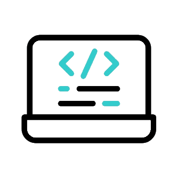
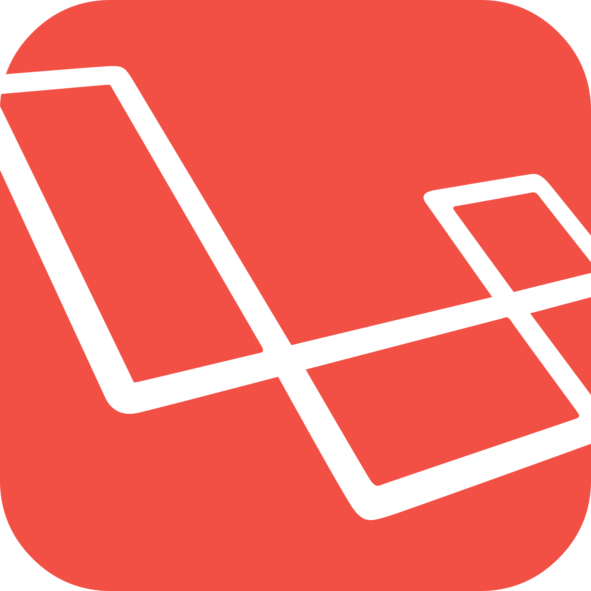
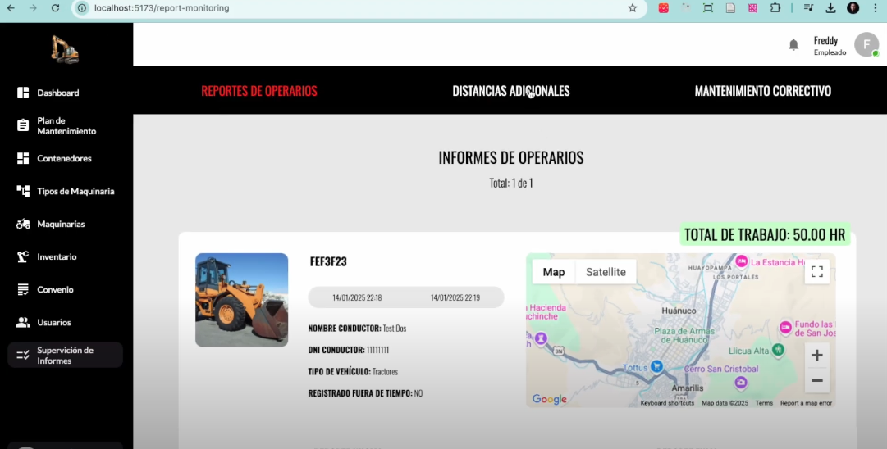
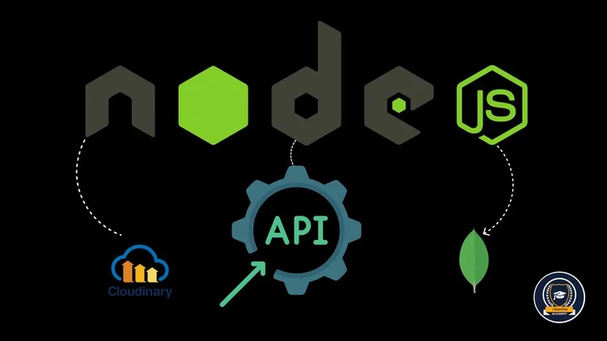
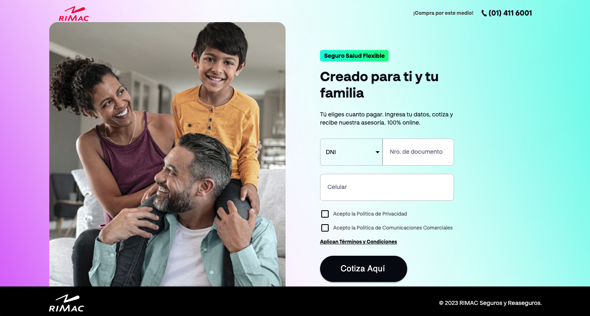
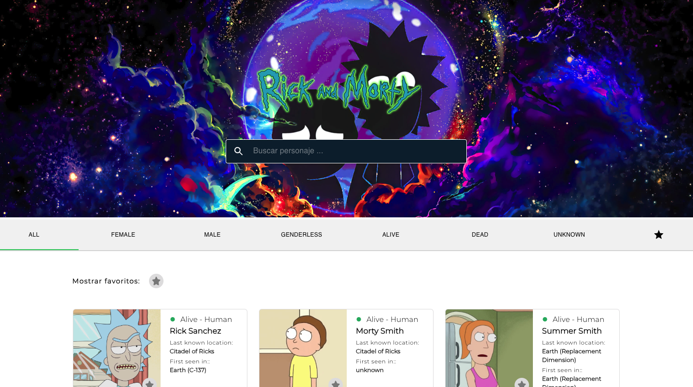

  
  <h3 align="center">Hey there, I'm <a href="https://carrillo.asynclogic.net/">Freddy</a>!!
    
  </h3>

## <picture></picture> About me

<picture> </picture>

 

- :computer: I am a passionate Software Engineer with experience in developing web and mobile applications. My professional focus is on creating modern, functional and scalable solutions.
- :computer: I love to continuously learn, develop impactful projects and share my knowledge with the community, whether developing educational projects or solving technical challenges.
 

## <picture>   </picture> Skills

<table>
  <tr>
    <td align="center">
      ReactJS
        
      <a href="#" target="_blank">
        
         
        (Ver certificado)
      </a>
    </td>
    <td align="center">
      NextJS
        
      <a href="https://cursos.devtalles.com/certificates/xyfwmdfxit" target="_blank">
        
         
        (Ver certificado)
      </a>
    </td>
    <td align="center">
      TypeScript
        
      <a href="https://cursos.devtalles.com/certificates/zqowpwnpdz" target="_blank">
        
         
        (Ver certificado)
      </a>
    </td>
    <td align="center">
      NodeJS
        
      <a href="https://www.udemy.com/certificate/UC-a3f39d08-3261-47ec-8ebe-be60f15e9b48/" target="_blank">
        
         
        (Ver certificado)
      </a>
    </td>
    <td align="center">
      AWS Serverless
        
      <a href="https://cursos-dev.com/certificate/9YncXfSwCI" target="_blank">
        
         
        (Ver certificado)
      </a>
    </td>
    <td align="center">
      Laravel
        
      <a href="#" target="_blank">
        
         
        (Ver certificado)
      </a>
    </td>
    <td align="center">
      React Native
        
      <a href="#" target="_blank">
        
         
        (Ver certificado)
      </a>
    </td>
  </tr>
</table>

## <picture>  </picture> Connect with me

	
	

## 📺 Private projects

<table>
  <tbody>
  <!-- YOUTUBE:START -->
    <tr>
      <td>
        
      </td>
      <td>
        <a href="https://www.youtube.com/watch?v=nBSaJsp5abc">
          Heavy Machinery Management System (Web & Mobile)
        </a>
         
        (Constantly improving, private repository)
      </td>
    </tr> 
    <tr>
      <td>
        
      </td>
      <td>
        <a href="https://github.com/FreddyCarrillo/CORE-NODE-API">
          Core Node API
        </a>
         
        (Constantly improving, public repository)
      </td>
    </tr>
  <!-- YOUTUBE:END -->
  </tbody>
</table>

## 📺 Challenges solved

<table>
  <tbody>
  <!-- YOUTUBE:START -->
    <tr>
      <td>
        
      </td>
      <td>
        <a href="https://rimac-challenge.asynclogic.net/">
          Rimac Challenge (2024)
        </a>
      </td>
      <td>
        <a href="https://github.com/asyncLogicAdmin/RIMAC-CHALLENGE">
          Repository
        </a>
      </td>
    </tr>
    <tr>
      <td>
        
      </td>
      <td>
        <a href="https://www.youtube.com/watch?v=yWA9t5McHuo">
          Rick and Morty Challenge (2021)
        </a>
      </td>
      <td>
        <a href="https://github.com/FreddyCarrillo/rickAndMorty">
          Repository
        </a>
      </td>
    </tr>
  <!-- YOUTUBE:END -->
  </tbody>
</table>

## 📺 Practical Classes: Discover the Projects I Teach

  <a href="https://gist.github.com/FreddyCarrillo/2bada6edf6799d46693d69b15a0f3f60">
    Click here
  </a>
  to open the tutorials and recorded classes.

 
<table>
  <tbody>
  <!-- YOUTUBE:START -->
    <tr>
      <td>
        eLearning Educational Platform (2025)
      </td>
      <td align="center">
        FE (ReactJS + TS)
         
        <a href="https://github.com/FreddyCarrillo/FE-ELEARNING">
          Repository
        </a>
      </td>
      <td align="center">
        BE (NodeJS)
         
        <a href="https://github.com/FreddyCarrillo/BE-ELEARNING">
          Repository
        </a>
      </td>
    </tr>
    <tr>
      <td>
        Rental Services Control System (2025)
      </td>
      <td align="center">
        FE (ReactJS + TS)
         
        <a href="https://github.com/FreddyCarrillo/FE-RENT-CONTROL">
          Repository
        </a>
      </td>
      <td align="center">
        BE (NodeJS)
         
        <a href="https://github.com/FreddyCarrillo/BE-RENT-CONTROL">
          Repository
        </a>
      </td>
    </tr>
  <!-- YOUTUBE:END -->
  </tbody>
</table>
